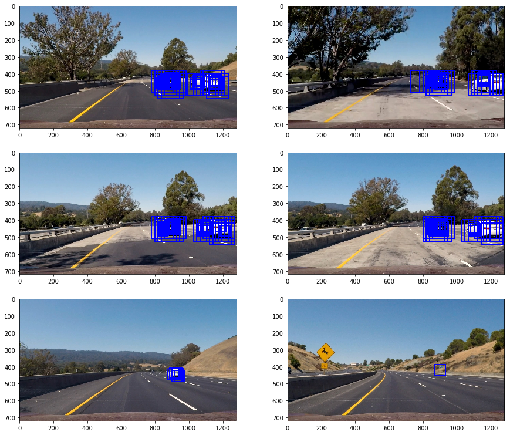

## Writeup Template
### You can use this file as a template for your writeup if you want to submit it as a markdown file, but feel free to use some other method and submit a pdf if you prefer.

---

**Vehicle Detection Project**

The goals / steps of this project are the following:

* Perform a Histogram of Oriented Gradients (HOG) feature extraction on a labeled training set of images and train a classifier Linear SVM classifier
* Optionally, you can also apply a color transform and append binned color features, as well as histograms of color, to your HOG feature vector. 
* Note: for those first two steps don't forget to normalize your features and randomize a selection for training and testing.
* Implement a sliding-window technique and use your trained classifier to search for vehicles in images.
* Run your pipeline on a video stream (start with the test_video.mp4 and later implement on full project_video.mp4) and create a heat map of recurring detections frame by frame to reject outliers and follow detected vehicles.
* Estimate a bounding box for vehicles detected.

### Writeup / README

The project code could be found on the [Vehicle Detection and Tracking notebook](Vehicle_Detection_Tracking.ipynb).

### Histogram of Oriented Gradients (HOG)

#### 1. Explain how (and identify where in your code) you extracted HOG features from the training images.

I started by loading in all the `vehicle` and `non-vehicle` images at `In [3]`.
Here is an example of one of each of the `vehicle` and `non-vehicle` classes:

Loading test images from ./training_images/vehicles/*/*png
Loading test images from ./training_images/non-vehicles/*/*png
Vehicle train image count: 8792
Non-vehicle train image count: 8968

Here is an example of those images:

The feature extraction code (spatial, color histogram and HOG) is at `In [5]`. This cell contains a set of functions provided by Udacity's lectures to extract the features from an image. The function `extract_features` combine them at `In [6].` `extract_images_features` defines a function to extract features from a list of images (e.g. for test images). 

I then explored different color spaces and different `skimage.hog()` parameters (`orientations`, `pixels_per_cell`, and `cells_per_block`).  I grabbed random images from each of the two classes and displayed them to get a feel for what the `skimage.hog()` output looks like at `In [7]`.
Here is an example using the `YCrCb` color space and HOG parameters of `orientations=9`, `pixels_per_cell=(8, 8)` and `cells_per_block=(2, 2)`:

#### 2. Explain how you settled on your final choice of HOG parameters.

The parameters were found by manually changing them and experimenting to try to maximize the model accuracy and minimize the fitting time. The final parameters are the following:

I spent a lot of time up front exploring different color spaces to determine which would give the
best results in terms of prediction accuracy. 
I finally settled on the YcrCb color space, as this gave 
high test set accuracy scores with my Support Vector Classifier and also gave the fewest false 
positives in the test videos.

|Parameter|Value|
|:--------|----:|
|Color Space|YCrCb|
|HOG Orient|9|
|HOG Pixels per cell|8|
|HOG Cell per block|2|
|HOG Channels|All|
|Spatial bin size| (16,16)|
|Histogram bins|32|
|Histogram range|(0,256)|
|Classifier|LinearSVC|
|Scaler|StandardScaler|

#### 3. Describe how (and identify where in your code) you trained a classifier using your selected HOG features (and color features if you used them).

I use a Linear Support Vector Machine for 
classification at `In [9]` and with the feature set mentioned above, it achieves 99.4% test accuracy.
I split the dataset into training and test sets 
with a 80/20% split. I regularize the data using a StandardScalar. I then train a LinearSVC to create
a predition model.
In addition to the LinearSVC, I use a CalibratedClassifierCV in order to be able to extract 
classification probabilities from the predictions.

### Sliding Window Search

#### 1. Describe how (and identify where in your code) you implemented a sliding window search.  How did you decide what scales to search and how much to overlap windows?

My first approach to implement sliding windows was to calculate all the windows and then apply the feature extraction to each one of them to find the one containing a car. It is implemented on `In [12]`. Cells `In [13]` and `In [14]` contains the code for loading the test images, applying the classifier to the images and drawing boxes. 
I decided to use multi-scale sliding windows over the image (
256x256, 128X128 and 64x64 pixels). The scales and overlap parameter where found by experimenting on them until a successful result was found. The following image shows the results of this experimentation on the test images:

To combine the boxes found there and eliminate some false positives, a heat map as implemented with a threshold and the function `label()` from `scipy.ndimage.measurements` was used to find where the cars were. The code for this implementation could be found on `In [18]`, and the next image shows the results on the test images:

#### 2. Show some examples of test images to demonstrate how your pipeline is working. What did you do to optimize the performance of your classifier?

The performance of the method calculating HOG on each particular window was slow. To improve the processing performance, a HOG sub-sampling was implemented as suggested on Udacity's lectures. The implementation of this method could be found on `In [24]`. The following image shows the results applied to the test images (the same heatmap and threshold procedure was applied as well on `In [25]`):

### Video Implementation

#### 1. Provide a link to your final video output.  Your pipeline should perform reasonably well on the entire project video (somewhat wobbly or unstable bounding boxes are ok as long as you are identifying the vehicles most of the time with minimal false positives.)

The video output could be found [project_video.mp4](output_videos/project_video.mp4)

#### 2. Describe how (and identify where in your code) you implemented some kind of filter for false positives and some method for combining overlapping bounding boxes.

Some effort was done already to minimize false positives using a heatmap and threshold in the pipeline, but it was not enough. The overlapping bounding boxes were resolved by using the function `label()` from `scipy.ndimage.measurements` to find the cars. To filter false positives, the image heatmap map was averaged over three consecutive frames. The implementation could be found on `In [29]`

### Discussion

#### 1. Briefly discuss any problems / issues you faced in your implementation of this project.  Where will your pipeline likely fail?  What could you do to make it more robust?

- The performance of the pipeline could be improved by trying to decrease the amount of space to search for windows. It takes around 3 seconds to process each 
frame currently.

- Implement the same with a deep learning approach
 in order to increase the speed.

- More than one scale could be used to find the windows and apply them on the heatmap.

- The windows size could change for different X and Y values to minimize the number of windows to process.

